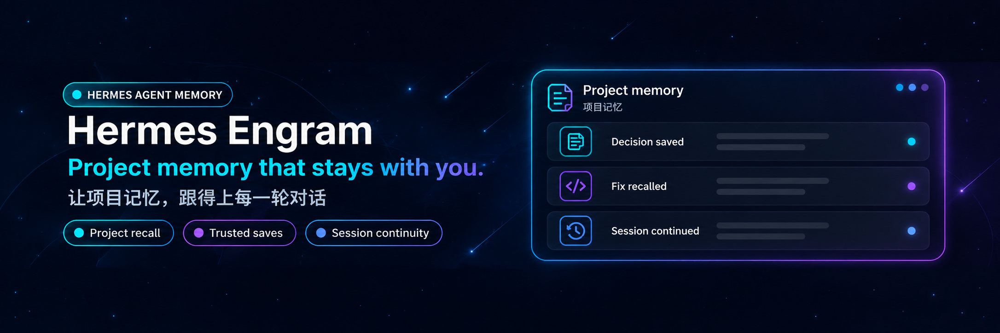

<p align="center">
  
</p>

<div align="center">

# Hermes Engram

**让项目记忆，跟得上每一轮对话。**

[](LICENSE)
[](https://github.com/NousResearch/hermes-agent)
[](pyproject.toml)
[](https://github.com/Gentleman-Programming/engram)

[MIT 开源协议](LICENSE)

</div>

> 社区维护的 Hermes Agent 插件，不是 Hermes 或 Engram 官方产品。

把 [Engram](https://github.com/Gentleman-Programming/engram) 接成 Hermes Agent 原生的 **memory provider**：每轮对话前按项目自动召回 Engram 记忆，界面上显示召回提示。参考官方 [Pi adapter](https://github.com/Gentleman-Programming/engram/tree/main/plugin/pi) 的输入过滤、private 脱敏、工具结果被动捕获及压缩摘要归档，不安装 Pi；默认仍使用 MCP，可选启用自管本机 HTTP 增强。

```text
🧠 Engram·dsh-codex-ui — recalled 5 memories
```

不用单独配置 `mcp_servers.engram`：插件自己常驻一个 `engram mcp` 子进程；原生增强开启后，指定写入与恢复走插件自管回环服务，召回仍走 MCP，也提供 `engram_*` 工具给模型主动调用。

## 钩子对照（参考 Engram 官方 Codex / Pi 插件）

| Codex 钩子 | Hermes 钩子 | 插件行为 |
|---|---|---|
| `SessionStart` | 本会话第一次确定项目时（在 `prefetch()` 里） | `mem_session_start` 注册 Engram 会话；注入近期上下文（`mem_context`）和记忆协议 |
| `UserPromptSubmit` | `prefetch()` + `sync_turn()` | 每轮关键词检索召回（`mem_search`）；回合结束后后台 `mem_save_prompt` 记录用户提问 |
| （模型主动保存） | `engram_*` 工具 | `engram_save` / `engram_session_summary` / `engram_judge` / `engram_search` / `engram_get`，自动带会话 id 和项目 |
| Pi `tool_execution_end` | 插件 observer `post_tool_call` | 非记忆工具结果先解析 JSON 字符串并递归提取文本字段；每段脱敏后超过 50 字符的真实多行正文交给 `mem_capture_passive` |
| `SubagentStop` | `on_delegation()` | 即使工具 hook 已注册也捕获异步完成结果；与同步 `delegate_task` 捕获按本会话、项目、脱敏正文哈希去重 |
| Pi `session_compact` | `on_session_switch(reason="compression")` + 后续 `sync_turn(messages=...)` | 按压缩时项目归档 Hermes 正式摘要；`on_pre_compress()` 只重置召回，不再把对话摘录冒充正式摘要 |
| `SessionEnd` | `on_session_end()` | `mem_session_end` 关闭本会话注册过的 Engram 会话 |

Hermes 压缩边界只在 `reason="compression"` 时沿用 Engram 会话与摘要去重；普通分支使用独立身份，`/new` 重置，`/undo` 撤销旧来源证明与在途召回。会话结束先撤销当前权限，后台关闭等待在途注册完成。

同 id 原地压缩也支持。归档前必须观察到 `reason="compression"`，并在后续完成回合或会话结束的 `messages` 中找到宿主的正式摘要前缀/结束标记；只取摘要正文，去掉 handoff 提示，不生成替代摘要。

### 输入与隐私

- 提问先去首尾空白和 `<private>...</private>` 块，再判断长度；默认 **超过 10 字符**且非 trivial 输入才记录，可配置 `prompt_min_chars`。长度是 Python 字符数，不是 UTF-8 字节数。
- 跳过 Hermes 已知的系统、压缩、异步委派、cron 等内部标记，以及宿主的压缩续写/迭代上限总结提示；`turn_author.is_bot=true` 的提问也跳过。真人 OUT-OF-BAND 消息不因包装标记被丢弃。
- 显式 private 块（不区分大小写、支持跨行）替换为 `[REDACTED]`。提问、工具结果、子代理结果在截断前脱敏；召回在关键词切分前脱敏；MCP 出站参数递归脱敏，覆盖主动保存及总结等路径。
- 在 Pi / Engram 严格约定之上**宁可多遮**：标签允许空白与换行（`<private >`、`</ private>`）；未闭合的开标签从开标签起遮到结尾；嵌套按深度配对到最外层闭标签；孤立闭标签原样保留。
- 这是**配对标签约定**，不是通用密钥/个人信息扫描器；不应把未加标签的秘密当作可安全存档的数据。

### 已核实的宿主加载路径

本机 Hermes 的 `plugins.memory._load_provider_from_dir()` 使用 `_ProviderCollector.collect()`，其 `register_hook()` 会将注册转发给真实 `PluginContext` 的 fallback hook registry。插件的 `register()` 将 **同一个 provider 实例**交给 `register_memory_provider()` 和 `post_tool_call`；通过 `model_tools._emit_post_tool_call_hook()` → `hermes_cli.lifecycle` 调用链验证捕获。

旧宿主若不支持 `register_hook` 或注册抛错，明确记录「工具捕获不可用」，provider 其余功能继续工作；不会伪造已注册。全局 hook 只有携带本 provider 当前 `session_id` 的结果才能写入，缺失 id、其他会话和子代理 id 一律跳过。

工具正文提取支持嵌套 dict/list 中的 `text`、`content`、`summary`、`output`、`stdout`、`stderr`、`result` 字段，以及这些字段里的 JSON 字符串（递归深度上限 20）。不重新 `json.dumps` 正文，保留真实换行，避免 Engram 的行首 Markdown 标题/编号提取失效；状态、计数、目标、note 等元数据不作为正文捕获。

本机宿主同步委派先通过 `tools.delegate_tool_results._notify_memory_manager()` 通知 `memory.on_delegation`，随后工具 hook 收到 `{"results":[{"summary":"..."}],"total_duration_seconds":...}` 的 JSON 字符串。默认后台委派的即时工具返回只有 `status="dispatched"`，完成正文仍由 `memory.on_delegation` 传递，不能因为 hook 已注册就禁用它。同步批次按每个 summary 正文独立去重，回调先后顺序不影响结果；不同正文继续捕获。去重只保留当前 provider 内本会话/项目的已入队哈希，不是跨重启或失败重试保证。

工具和子代理正文先脱敏，再在入队前截断到 **30000 UTF-8 字节**，后台闭包不持有完整巨大结果或原始 JSON 包装。仅有 `dispatched` 元数据不会触发捕获。捕获仍须满足平台、primary、会话 id、已知项目和确认归属的 Engram 会话边界。

### 压缩归档状态与去重

`provider.compaction_status(session_id=...)` 返回项目 + 脱敏正文哈希对应的状态，不返回正文：`pending`（排队）、`saved`（MCP 成功返回）、`failed`（明确 MCP 拒绝）、`unknown`（超时/异常，可能已写入）。同一会话 lineage 的同项目同摘要只派发一次，压缩轮换/原地压缩沿用去重表；`/new` 重置。

失败或未知状态**不自动重放**，避免未知提交被重复写入；需要重试时可显式调用 `engram_session_summary`。状态和去重表只在当前 provider 进程内存在，不是跨重启 exactly-once 保证。

## 安全边界

- **项目判定**：点名唯一项目 > 会话工作目录绑定 > 本会话沿用。点名多个、写了不存在的项目、判断不了时一律跳过，**绝不跨项目读写**。
- **本轮归属与追问历史分离**：每次 `prefetch` 先撤销本轮确认；多项目、未知项目、项目解析异常或空输入不会继承上轮写权限。提问记录、工具/委派被动捕获和省略 `project` 的主动工具只使用本轮已确认项目；拒绝轮的压缩也不能借历史项目归档。历史项目仍保留，下一次合法追问重新解析后可恢复（即使没有新召回正文）。显式工具 `project` 仍须属于已知项目，不自动建项目；`engram_get` / `engram_judge` 按显式记录/判断 id 工作，不依赖默认项目。
- **来源同步绑定**：`prefetch` 保存脱敏正文哈希与当时项目判定（包括拒绝）。宿主延迟执行 `sync_turn` 时只匹配来源记录，不读取最新项目；来源缺失、正文转换不一致或同文判定冲突时跳过。`on_turn_start` 撤销上一轮权限并阻止陈旧召回发布；没有回合 ID 的同文重复保守拒绝。最多保留 2048 个来源键，达到容量后停止本会话提问自动保存，不淘汰拒绝记录重新授权。
- **后台归属快照**：provider 收到任务后固定项目；后台委派从工具参数 `tasks[].goal` 记录派发时会话/项目，完成通知按该来源匹配。冲突、容量耗尽或 `/new` 后的旧任务不写；缺少派发证据的完成通知一律跳过。同步路径即使完成回调先于 observer 到达，工具最终正文仍会被捕获；不借当前项目补猜来源。正式摘要保留压缩时已确认的归属。
- **首次项目登记**：`auto_create_projects=true` 时，未绑定目录只在真实会话 cwd 位于 Git 仓库、允许 primary/本机写入且没有未知/多项目点名时初始化。通过 `git rev-parse` 确认根目录，调用 `mem_session_start(id, directory)`，采用 Engram canonical 项目名并刷新目录绑定表核对。兼容本机 Engram 3.0.0，不依赖其不支持的 `mem_current_project(cwd)` 参数。普通目录、父目录子仓库扫描、用户主目录与后端进程 cwd 不触发首次登记；这是比官方普通目录名回退更严格的边界。Engram 可能在 `.git` 的共享元数据内创建私有项目身份文件，Git worktree 复用该身份。
- **已有项目会话注册**：点名项目必须已有，且会话目录绑定与 Engram 注册应答一致才挂会话；不会根据任意未知文本创建项目。
- **可执行文件解析**：`engram_path` 必须是绝对路径；留空时只在 `PATH` 的绝对目录里查找，跳过当前目录与相对目录（Windows 的 `shutil.which` 与 `CreateProcess` 都会优先查当前目录，而 Hermes 恢复会话会切到会话 cwd）。`git` 同样按此规则解析为绝对路径，`taskkill` 固定使用 `%SystemRoot%\System32`。找不到可信路径时插件不启用、不报错。
- **没有确认归属的会话**：只读召回照常；`engram_save` 等工具改用显式 `project`、不挂会话；提问记录和被动捕获直接跳过（Engram 在缺会话时会按进程目录猜项目）。
- **谁能写**：只在 primary 上下文和允许的平台写入。子代理、cron、IM 渠道不写；写工具在这些场景下直接返回错误。
- **不阻塞对话**：写入都放进一个后台线程串行执行；召回有单轮总预算，超时就跳过。
- **不泄露内容**：失败日志只记异常类别，不记用户问题和记忆正文；子进程强制关闭云同步（`ENGRAM_CLOUD_AUTOSYNC=0`），并忽略外部的 `ENGRAM_PROJECT`。
- **用户主目录、盘符根**这类宽泛的目录绑定只允许精确匹配，不会兜住它下面的所有子目录。

## 安装

需要先装好 Engram（`engram mcp` 可用）。插件不依赖第三方 Python 包。

```powershell
[Console]::OutputEncoding = [System.Text.Encoding]::UTF8
$OutputEncoding = [System.Text.Encoding]::UTF8

# 1. 复制插件到 $HERMES_HOME\plugins\engram（已有旧版本会先备份为 .engram.bak）
python D:\Repository\hermes-plugins\hermes-engram\scripts\install.py

# 2. 指定 engram 路径并切换 memory provider（同一时间只能有一个外部 provider，会替换 holographic）
hermes config set plugins.engram.engram_path D:/Tools/engram/engram.exe
hermes config set memory.provider engram

# 3. 确认
hermes memory status
```

切换后重启 Hermes（桌面端 / 网关）才会生效。不需要再配 `mcp_servers.engram`；如果还留着，会和 `engram_*` 工具重复。

### 可选原生增强

`plugins.engram.native_http=true` 时，插件用指定 Engram 可执行文件启动**自己管理的回环 HTTP 子进程**（随机端口、同一数据目录、关闭云同步）；不连接任意远端 URL，不停止用户已有服务。默认值为 `false`，MCP-only 用户不受影响。

- **恢复身份**：探测 `/health` 的 `root_session_resume`；支持时采用服务端确认的 continuation。旧核心使用经过确认的本地续会话，不冒充服务端恢复。
- **卫星会话**：只服务模型显式指定 `project` 的写入工具（`engram_save` / `engram_session_summary`）。跨项目写入先检查 `isolated_session_registration`，注册 `project_owned` 隔离会话；缺少能力直接拒绝，不挂当前目录。提问记录、被动捕获、委派结果、压缩归档与 MCP 模式一致，只写目录绑定会话，不借卫星会话跨项目落库。
- **总结元数据**：主动 `engram_session_summary` 每次独立保存（标题 `Session summary`）；只有压缩归档使用固定 `topic_key=session/compaction-recovery` 做覆盖更新，与官方 Pi 一致。
- **子进程恢复**：原生服务退出后，下一次调用会重新拉起并重新校验实例身份，不会永久失效。
- **保存结果确认**：写入前探测正式 `/observations/save-result` 协议，冻结一次 `operation_id` 与脱敏正文。响应丢失后只做只读查询，不重新 POST。结果不确定时返回 `outcome=unknown` 与操作 ID，使用 `engram_recover_save` 查询。
- **压缩恢复**：下一轮在召回区输出一次归档状态；增强模式可读取 `/context/compaction`。历史上下文不是新指令，不修改系统提示缓存。

**版本边界：Engram 3.0.0 不声明根会话恢复；3.2.1 已声明根恢复与隔离注册，但未提供当前官方 main 的保存结果查询端点。原生可靠保存需要实际提供该端点的核心，不能只看版本号。旧核心会在写入前明确拒绝，不会静默绕过确认。**

`persist_sessions=true` 默认在当前 `$HERMES_HOME/plugins-state/engram.sqlite3` 保存已确认的项目/会话身份，按 Engram 数据目录隔离；不保存提问或记忆正文，恢复仍需服务端再次确认。只读/禁写渠道不创建该日志。

```powershell
[Console]::OutputEncoding = [System.Text.Encoding]::UTF8
$OutputEncoding = [System.Text.Encoding]::UTF8
hermes config set plugins.engram.native_http true
```

### 只读模式

不想自动写入时：

```powershell
hermes config set plugins.engram.auto_capture false
```

此时不注册会话、不记录提问、不做被动捕获和压缩存档，也不暴露写工具，只保留召回和 `engram_search` / `engram_get`。

### 回滚

```powershell
hermes config set memory.provider holographic
```

## 配置

都在 `config.yaml` 的 `plugins.engram` 下，全部可选：

| 键 | 默认值 | 说明 |
|---|---|---|
| `engram_path` | PATH 绝对目录中的 `engram` | engram 可执行文件**绝对路径**；相对路径会被拒绝 |
| `platforms` | `[desktop, cli, tui, gui, local, acp]` | 允许召回和写入的平台；IM 渠道默认不在内 |
| `auto_capture` | `true` | 自动写入总开关（会话注册、提问记录、被动捕获、压缩存档、会话关闭、写工具） |
| `auto_create_projects` | `true` | 从真实会话 cwd 的未绑定 Git 仓库首次登记项目；项目名由 Engram 解析 |
| `capture_prompts` | `true` | 按来源证据记录用户提问（`mem_save_prompt`） |
| `prompt_min_chars` | `10` | 脱敏后的提问必须超过此字符数才记录 |
| `capture_tools` | `true` | 通过真实 `post_tool_call` 被动捕获非记忆工具结果；依赖宿主加载器提供 hook 注册 |
| `capture_delegation` | `true` | 捕获子代理完成正文（包括默认后台委派）；同步工具重复正文按会话/项目去重 |
| `compaction_summary` | `true` | 完成回合或结束时归档正式摘要，不是压缩前摘录 |
| `native_http` | `false` | 自管回环服务，能力检查后启用恢复、卫星会话、保存结果查询 |
| `persist_sessions` | `true` | 当前 profile 中持久化已确认会话身份，不保存正文 |
| `command` | 无 | 高级/测试用：完整启动参数**列表**（如 `["D:/Tools/engram/engram.exe", "mcp"]`），优先于 `engram_path`；写成字符串会被拒绝 |
| `tools` | `true` | 注册 `engram_*` 工具并注入记忆协议 |
| `max_bytes` | `6000` | 单轮注入总字节上限（UTF-8），含记忆协议 |
| `context_bytes` | `3000` | 近期上下文字节上限 |
| `search_bytes` | `2200` | 检索结果字节上限 |
| `search_limit` | `5` | 每轮检索条数 |
| `call_timeout` | `4.0` | 召回时单次 MCP 调用超时（秒） |
| `total_budget` | `7.0` | 单轮召回总预算（秒），要小于 Hermes 外部 provider 的 8 秒上限 |
| `write_timeout` | `8.0` | 后台写入和工具调用的单次超时（秒） |
| `exact_only_dirs` | `[]` | 额外的「只允许精确匹配」绑定目录；用户主目录和盘符根始终如此 |

## 目录结构

```text
engram/              # 插件本体，安装时整个复制到 $HERMES_HOME/plugins/engram/
  __init__.py        # EngramMemoryProvider + register()：钩子、会话注册、后台写入、工具分发
  capture.py         # 输入识别、private 脱敏、正式摘要提取、会话 id、记忆协议、工具 schema
  recall.py          # 纯函数：项目判定、中文二元组检索词、字节截断、结果格式化
  mcp_client.py      # 常驻 engram mcp 子进程的极简 MCP stdio 客户端（懒启动、超时即重启）
  native_runtime.py  # 可选原生协议：自管 HTTP、能力检查、operation_id 只读恢复
  session_journal.py # profile/数据目录隔离的已确认会话身份日志
  plugin.yaml
scripts/
  install.py         # 安装到 $HERMES_HOME/plugins/engram/
  e2e_smoke.py       # 隔离 HERMES_HOME + 真实 engram 的端到端冒烟（--write 用临时 Engram 库验证写入）
tests/               # pytest，后端用假 MCP 服务，接口直接引用本机 Hermes 源码
```

## 开发与测试

测试直接 import 本机 Hermes 源码（默认 `%LOCALAPPDATA%\hermes\hermes-agent`，可用 `HERMES_AGENT_DIR` 覆盖），用 Hermes 自己的 venv 跑：

```powershell
[Console]::OutputEncoding = [System.Text.Encoding]::UTF8
$OutputEncoding = [System.Text.Encoding]::UTF8
$py = "$env:LOCALAPPDATA\hermes\hermes-agent\venv\Scripts\python.exe"

# 单元 + 集成测试（不改 Hermes venv，pytest 由 uv 临时提供）
uv run --no-project --python $py --with pytest python -m pytest -q

# 端到端·只读：Hermes 加载器 + 真实 Engram 库，只输出字节数、耗时和召回提示
& $py scripts\e2e_smoke.py --engram D:\Tools\engram\engram.exe --cwd D:\Repository\deepseek-harness-plugin\dsh-codex-ui

# 端到端·写入：在 Hermes scratch 下创建临时 HERMES_HOME / ENGRAM_DATA_DIR / Git 仓库，结束后删除；--cwd 在写入模式下被忽略
& $py scripts\e2e_smoke.py --engram D:\Tools\engram\engram.exe --cwd . --write

# 原生增强：传入已核对、带保存结果查询端点的 Engram，不替换本机安装
& $py scripts\e2e_native.py --engram D:\path\to\engram.exe
```

`--write` 不会在任何真实仓库的 `.git` 里留下 Engram 私有身份文件（项目登记只发生在临时 Git 仓库）。它使用真实 Hermes provider 加载器、真实工具 observer 发射函数、真实委派 memory 通知函数及真实 `engram mcp`。夹具采用宿主真实 `delegate_task` 同步 JSON 包装和后台 dispatched/完成路径，最后只读回临时 SQLite，分别断言同步重复正文、仅工具 JSON 正文、后台完成正文各落库一次，并核实项目/会话归属、private 脱敏、提问过滤、正式摘要单次归档（且不带宿主压缩标记）及会话关闭。摘要测试夹具采用宿主正式标记格式，**没有请求在线模型，不宣称验证了 LLM 生成质量或实际子代理调度**。pytest 覆盖真实加载器/MemoryManager 集成及明确拒绝、超时状态；假 MCP 只确认传输，不伪报 extracted/saved 数量，真实提取落库由隔离库 e2e 验证。

## 已知限制

- Hermes 的 `sync_turn` 不带回合 ID，因此正文哈希配对是保守来源证据，不是完整的回合身份；无法可靠配对时会少记，不猜目标项目。
- 检索是关键词规则（中文按二元组切分），不是语义召回。
- 外部 memory provider 同一时间只能启用一个，启用 Engram 会停用 holographic。
- 召回内容在聊天界面不显示正文，只显示召回提示；完整内容在发给模型的 `api_content` 里。
- 被动捕获依赖 Engram 的 `## Key Learnings:` 提取规则：实测中文条目要用空格分词才会被提取，整句不带空格的中文会被忽略。记忆协议里已提示模型这样写。
- Hermes memory provider 没有 `on_post_compress(summary=...)` 生命周期参数；`on_session_switch` 只通知 reason/id。归档由携带正式摘要的完成回合同步或会话结束触发；宿主不传 messages、没有正式标记或进程强制退出时仍可能漏归档；不承诺压缩前 durable checkpoint。
- Hermes 未提供 Pi 的输入 `source="extension"` provenance；只能过滤已核实的内部标记/常量与机器人作者，未标记的扩展输入无法可靠识别，不能声称全部合成输入已跳过。
- 当前摘要提取依赖宿主摘要常量和 carrier 标记格式；不支持未确认的旧格式或 provider-native opaque compaction。宿主常量不可导入时跳过归档（不使用猜测的兜底标记），提问记录与会话关闭照常进行。归档状态在压缩后的下一次召回中提示一次，不修改系统提示缓存。
- Hermes 先读取工具 schema 再初始化 provider，因此 `engram_*` 工具在 IM 渠道也会出现在工具列表里，但写工具调用会被拒绝。
